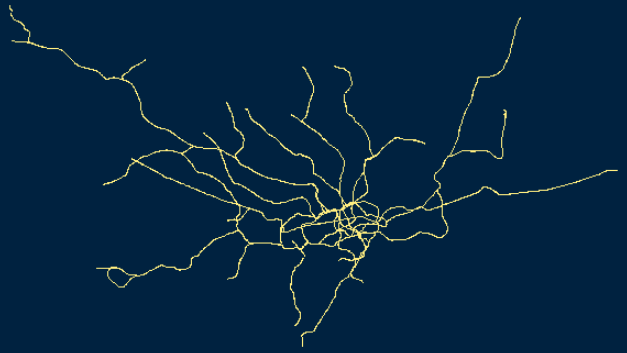

```{r setup, include=FALSE}
knitr::opts_chunk$set(echo = TRUE,cache=F,warning = F,message=F)
path <- "C:/github/maps_challenge/mc2021/maps/"
```

## Day 1 - Points

Ok let`s start my second year of #30daymapchallenge by @tjukanov. For me, the goal is again to publish a map every day. I'm looking forward to many impressive maps. #rstats 

```{r}
library(maps)
data(world.cities)
map()
map.cities(world.cities,col=rgb(0,0,1,.008),
           cex=1,pch=20,bg="gray")

```


## Day 2 - Lines

Day 2 of #30daymapchallenge and the topic is lines. You can see the subway lines of London. The data is from @OpenStreetMap. I used the #rstats packages osmdata and tmap. Thanks to @bikesRdata @MartijnTennekes.




- get the [bounding box](https://www.rdocumentation.org/packages/osmdata/versions/0.1.6/topics/getbb)

- [command bbox](https://search.r-project.org/CRAN/refmans/geojson/html/bbox.html)

```{r,cache=T,eval=F}
library(osmdata)
library(osmplotr)
bbox <- getbb("London")
dat_pa <- extract_osm_objects(key = 'route',
                              value = "subway",
                              bbox = bbox)

map <- osm_basemap(bbox = bbox, bg = c("black"))
map <- add_osm_objects(map, dat_pa, col = c("blue"))
# further objects can be added
print_osm_map(map)

```


```{r,cache=T,eval=F}
library(osmdata)
library(osmplotr)
bbox <- getbb("Wiesbaden")
dat_pa <- extract_osm_objects(key = 'highway',
                              value = "primary",
                              bbox = bbox)
dat_sa <- extract_osm_objects(key = 'highway',
                              value = "secondary",
                              bbox = bbox)

map <- osm_basemap(bbox = bbox, bg = c("#F5F5DC"))
map <- add_osm_objects(map, dat_pa, col = c("#00008B"))
map <- add_osm_objects(map, dat_sa, col = "green")
# further objects can be added
print_osm_map(map)

```

```{r,eval=F}
library(osmdata)
library(osmplotr)

datapath <- "C:/github/maps_challenge/data/"

load(paste0(datapath,"penang_lines_prim.RData"))
load(paste0(datapath,"penang_lines_sec.RData"))
bbox <- getbb("Penang")
map <- osm_basemap(bbox = bbox, bg = c("#F5F5DC"))
map <- add_osm_objects(map, dat_pa, col = c("#00008B"))
map <- add_osm_objects(map, dat_sa, col = "green")
# further objects can be added
print_osm_map(map)
```

```{r,eval=F}
png(paste0(path,"mapchallenge_day2_lines.png"))
print_osm_map(map)
dev.off()
```


## Day 3 - Polygons

Day 3 of #30daymapchallenge - Polygons. You can see the zip code areas in Germany. I used data from suche-postleitzahl.org and #rstats packages #ggplot2 and sf. Thanks to @edzerpebesma, @RogerBivand, @tiennebr, @ianmcook, @robinlovelace, @hadleywickham, @thomasp85 and all the others


- [PLZ Shapefiles](https://www.suche-postleitzahl.org/downloads)

```{r}
library(maptools)
data("wrld_simpl")
plot(wrld_simpl,col="royalblue")
```


```{r,eval=F}
require(sf)
setwd("C:/Arbeit/Forschung/geoscience/data/")
shape <- read_sf(dsn = ".", layer = "plz-gebiete")
save(shape, file="plz.RData")
```


```{r}
load("C:/Arbeit/Forschung/geoscience/data/plz.RData")
library(tmap)
qtm(shape)
library(ggplot2)

ggplot(shape) +
  geom_sf(color = rgb(0,0,.5,.2), size = 0.1, fill = "lightblue") 
```


## Day 4 Hexagons

<!--
- https://cran.r-project.org/web/packages/sugarbag/readme/README.html

- https://statisticsglobe.com/rename-files-using-r

- https://rud.is/b/2015/05/14/geojson-hexagonal-statebins-in-r/

https://github.com/tjukanovt/30DayMapChallenge
-->

Day 4 of #30daymapchallenge. The topic is hexagon. I cheat a little bit. A map of the country I like a lot is also called L'hexagone. The data is from gadm.org and I used the #rstats packages #tmap and #raster. #france


```{r,eval=F}
library(tmap)
fra0 <- raster::getData('GADM', country='FRA', level=0)
 qtm(fra0,fill="royalblue")
```


```{r,eval=F}
path <- "C:/Arbeit/Forschung/geoscience/data/"
setwd(path)
file.rename("us_states_hexgrid.geojson.txt","us_states_hexgrid.geojson")
us <- readOGR("us_states_hexgrid.geojson", "OGRGeoJSON")
```


## Day 5 Data Challenge 1: OpenStreetMap

<!--
https://wiki.openstreetmap.org/wiki/Map_features
-->

- Get the [osm data](https://learnosm.org/en/osm-data/getting-data/) 

```{r osmdatawb2,eval=F}
library(osmdata)
library(osmplotr)
bbox <- getbb("Madrid")
dat_pa <- extract_osm_objects(key = 'highway',
                              value = "primary",
                              bbox = bbox)
dat_sa <- extract_osm_objects(key = 'highway',
                              value = "secondary",
                              bbox = bbox)

dat_ta <- extract_osm_objects(key = 'highway',
                              value = "tertiary",
                              bbox = bbox)

map <- osm_basemap(bbox = bbox, bg = c("gray"))
map <- add_osm_objects(map, dat_pa, col = c("#00008B"))
map <- add_osm_objects(map, dat_sa, col = "green")
map <- add_osm_objects(map, dat_ta, col = c("#8B0000"))
# further objects can be added
print_osm_map(map)

save(dat_pa,file=paste0(datapath,"madrid_lines_prim.RData"))
save(dat_sa,file=paste0(datapath,"madrid_lines_sec.RData"))
save(dat_ta,file=paste0(datapath,"madrid_lines_ter.RData"))

```

## Red

```{r mysdata,cache=T,eval=F}
MYS3 <- raster::getData('GADM', country='MYS', level=3)
tmap::qtm(UGA3,"NAME_2")
```


```{r}
library(tmap)
shape$fantasy_val <- runif(nrow(shape))
plz1 <- substr(shape$plz,1,1)
plz5 <- shape[plz1=="5",]
qtm(plz5,"fantasy_val",fill.palette = rgb(seq(0,1,.1),0,0))

```


## Green

```{r}
library(tmap)

data(World)
World$fantasy_val <- runif(nrow(World))
qtm(World,"fantasy_val", fill.palette = rgb(0,seq(0,1,.1),0))
```


## Day 8 Blue

```{r}
library(tmap)
data(World)
World$fantasy_val <- runif(nrow(World))
qtm(World,"fantasy_val", fill.palette = rgb(0,0,seq(0,1,.1)))

```

```{r}
library(tmap)
shape$fantasy_val <- runif(nrow(shape))
plz1 <- substr(shape$plz,1,1)
plz6 <- shape[plz1=="6",]
qtm(plz6,"fantasy_val",fill.palette = rgb(0,0,seq(0,1,.1)))
```

## 9 Monochrome

- [Examples for monochrome maps](https://somethingaboutmaps.wordpress.com/monocarto-2019-winners/)

```{r wormsdat,cache=T,eval=F}
library(osmdata)

bbox <- getbb ("Worms")
dat_osm <- extract_osm_objects (value="highway", bbox = bbox)
qtm(dat_osm,fill=c("#B0B0B0"),borders=c("#8B7D6B"))

```


## 10 Raster

```{r}

path <- "C:/Users/X230/Downloads/NE1_50M_SR_W/NE1_50M_SR_W/"

dat <- raster::stack(paste0(path,"NE1_50M_SR_W.tif"))


sp::spplot(dat,"NE1_50M_SR_W.1")

```


## 11 3D

```{r isosurf,cache=T}
library(plot3D)
x <- y <- runif(100)
z <- rnorm(100)
M <- mesh(x, y, z)
R <- with (M, sqrt(x^2 + y^2 +z^2))
p <- sin(2*R)/(R+1e-3)
isosurf3D(x, y, z, colvar = p, level = 0)
```


## 12 Population

```{r}
library(tmap)
data("World")
qtm(World, fill="pop_est",fill.title="population")
```


## 13 Data Challenge 2: [Natural Earth](https://cran.r-project.org/web/packages/rnaturalearth/README.html)

- r package [rnatualearth](https://cran.r-project.org/web/packages/rnaturalearth/README.html)

```{r}

```


## 14 Map with a new tool

```{r}
#library(rdeck)
```


## 15 Map made without a computer

## 16 Urban/rural

## 17 Land

## 18 Water

```{r watersaarland,cache=T,eval=F}
library(osmplotr)
gc <- geocode_OSM("Berlin")
bbox <- get_bbox (gc$bbox)
dat_osm <- extract_osm_objects (key="natural",
                                value="water", bbox = bbox)
```


## 19 Islands

```{r vutdat,cache=T}
VUT2 <- raster::getData('GADM', country='VUT', level=2)
  qtm(VUT2,fill="green")
```


## 20 Movement

```{r barcelonadat,cache=T,eval=F}

library(osmplotr)
library(ggplot2)
gc <- geocode_OSM("Barcelona")
bbox <- get_bbox (gc$bbox)
dat_osm <- extract_osm_objects (key="route",value="subway", bbox = bbox)
ggplot() + geom_sf(data = dat_osm,aes(col=ref))

```


## 21 Elevation

```{r elavat,cache=T}
library(elevatr)

elevation <- get_elev_raster(dat_pa, z = 9)
plot(elevation)
```


## 22 Boundaries

```{r}
library(maptools)
data("wrld_simpl")
plot(wrld_simpl,col="red")
```


## 23 Data Challenge 3: [GHSL](https://ghsl.jrc.ec.europa.eu/)

```{r}

```


## 24 Historical map

```{r}

c1880 <- rgdal::readOGR("C:/Users/X230/Downloads/1880/cntry1880.shp")
  
tmap::qtm(c1880,fill="royalblue",borders = "lightgray")


# #30daymapchallenge day 17 - historical map - borders of 1880. Historical country GIS data from Thinkquest. Made with tmap #rstats #rspatial package. 

  
# data from:
# http://web.archive.org/web/20080328104539/
# http://library.thinkquest.org:80/C006628/download.html


```


## 25 Interactive map

```{r,eval=F}
library(leaflet)
```


## 26 Choropleth map

## 27 Heatmap

## The Earth is not flat

```{r}
library(globe)

globeearth()
globeearth(eye=place("everest"),col="royalblue")

```


## 29 NULL

```{r}

```


## 30 Metamapping day

<!--
Final day! Spend the day either by 1) collecting your entries from the challenge to a common gallery, 2) writing a tutorial or a blog post on one of your maps or 3) create a map from a theme you have chosen yourself

https://github.com/qgis/QGIS-Enhancement-Proposals/issues/235
https://stackoverflow.com/questions/58018950/ggplot-and-sf-for-overlaying-two-layers-of-polygons-shp


https://r-spatial.org/r/2018/10/25/ggplot2-sf.html
-->


